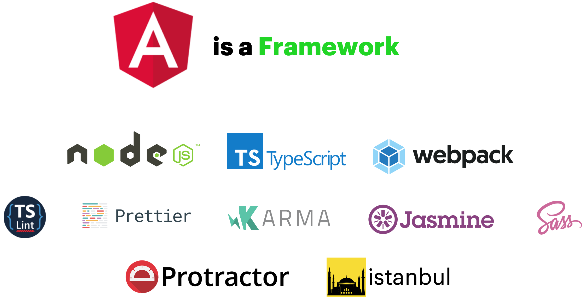
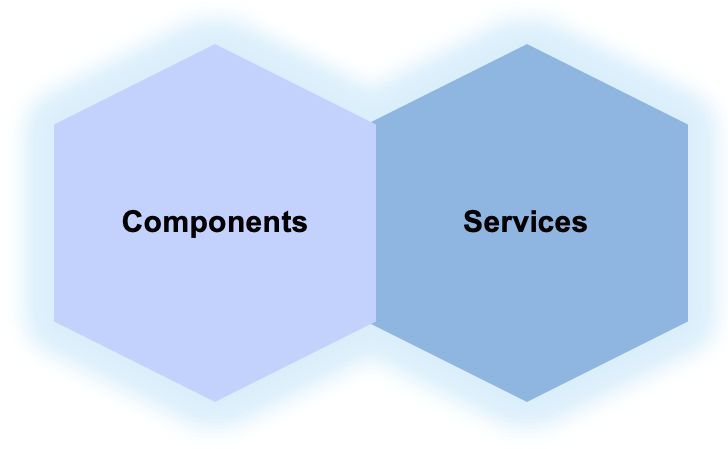
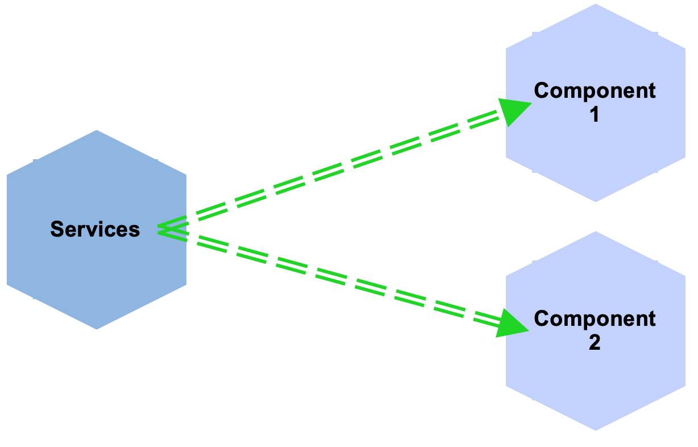

# Lab 0 - What is Angular

## Table of Contents
* [Angular. A Framework for Mobile and Desktop](#Angular.-A-Framework-for-Mobile-and-Desktop)
* [Angular Architecture](#Angular-Architecture)
* [Resources](#resources)

Brief definition of main elements and their relations. Explain the relation between UI elements and Angular components to build the app.

* Resources
Links to the official documentation, free books, free starter kits...

    

# Angular. A Framework for Mobile and Desktop
 Definition and SPAs / Versions difference / Programming language used

**Angular** is a very popular framework focused on the creation of **SPAs** based heavily on its own **Dependency Injection Framework**, Angular two main pillars: **Components** and **Services**, and **TypeScript**.

The official Angular site states:

> "Angular is a platform that makes it easy to build applications with the web. Angular combines **declarative templates**, **dependency injection**, **end to end tooling**, and **integrated best practices** to solve development challenges. Angular empowers developers to build applications that live on the web, mobile, or the desktop".

## Some History 
**Angular** was created by **Google** in 2010 taking the Frontend development world by storm having an easy-to-use JavaScript framework that treated HTML as a first-class citizen. 

Angular was very popular for:
* Easy **binding** of data to HTML elements.
* **Directives** providing an easy way to create reusable HTML + CSS components. 
* **Client-side reusable components** very popular in server-side.
*  **Dependency injection** also popular in enterprise applications.

But because of its popularity and older JavaScript versions in that time, developers were starting to run into severe performance problems when they tried to bind too many model objects to too many DOM elements.

Meanwhile, **Facebook** released **React** in 2013 and **Vue** was released later by a single developer, **Evan You**, in 2014.

    

> Some comparisons in [Medium](https://medium.com):
> - [React vs Angular vs Vue.js — What to choose in 2019?](https://medium.com/@TechMagic/reactjs-vs-angular5-vs-vue-js-what-to-choose-in-2018-b91e028fa91d)
> - [React vs Angular vs Vue.js: A Complete Comparison Guide](https://medium.com/front-end-weekly/react-vs-angular-vs-vue-js-a-complete-comparison-guide-d16faa185d61)

Angular was still dominant but *Google Angular Team* itself decided to release a breaking version in 2016: **Angular 2**.

That was the debacle for Angular, with a new framework not compatible with previous versions, two new languages not clear which could be the official one during Angular alpha and beta stages… 
> This situation gave a lot of Angular developers reasons to try another options. Also, to complicate it more, Angular 1.x was renamed to **Angular.JS** while Angular 2 kept **Angular**.

Nowadays Angular has been slowly recovering but it’s still very far from React.

    

[See npm trends](https://www.npmtrends.com/react-vs-@angular/core-vs-vue) for more information

## Angular Facts
* It’s NEITHER **Java** nor **Angular.js**!!!
* It’s a **Framework**. Suck that **React**!
* **JavaScript** is dead. Long life **TypeScript**! :+1:
* It’s **NOT** Java...
* ~~MVC~~, is **MVVM** = Model–View–ViewModel.
* It’s **NOT** Java!!! HHRR people, please, stop sending Frontend positions as "Java CVs" **;)**

# Angular Technologies 
Angular is packed together with a set of robust technologies and libraries for testing like **karma**, **protractor**, **jasmine**, **protractor** and **istambul**, together with code quality tools or linter like **TSLint** or module bundlers like **webpack** among others.

## Angular Languages
Angular is available in two flavours: 
* [TypeScript](https://github.com/Microsoft/TypeScript) 
* [Dart]( https://www.dartlang.org/)

### TypeScript

**[TypeScript](https://github.com/Microsoft/TypeScript)** is a typed superset of **JavaScript** that compiles directly to JavaScript code. It was created by Microsoft as a way for **C#** and **Java** developers to easily move to JavaScript world with a more powerful and type language.

TypeScript makes JavaScript more like a **strongly-typed, object-oriented language** easier to debug and maintain, two of the weakest points of standard JavaScript.

[TypeScript Notes for Professionals](https://goalkicker.com/TypeScriptBook2/) book

### Dart

Dart is an object-oriented, class defined, garbage-collected language using a C-style syntax that transcompiles optionally into JavaScript. It supports interfaces, mixins, abstract classes, reified generics, static typing, and a sound type system.

[See Angular Dart](https://webdev.dartlang.org/angular) for more information.

>> **Notice that we will focus only on TypeScript in this Openathon**

# Angular Architecture
In order to truly understand Angular we need to previously understand it's main concepts.
But, firstly, have a break!

## SPAs
A **[Single-Page Application](https://blog.angular-university.io/why-a-single-page-application-what-are-the-benefits-what-is-a-spa/)** is a web app **compiled to JavaScript** that dynamically renders sections of a page *without requiring a full reload from a server*.

What generally happens is that the SPA framework (Angular, for example) intercepts the browser events and instead of making a new request to the server (a new document/page), requests some JSON or performs an action on the server but the page that the user sees is never completely wiped away, and behaves more like a desktop application.

## Dependency Injection
**[Dependency Injection (DI)](https://angular.io/guide/dependency-injection)** is an application design pattern where users don't need to create instances by thenselves. *Is a way to create objects that depend on other objects*. A A DI system (Angular DI, for example) supplies the dependent objects (called the dependencies) when it creates an instance of an object .

## Modules
**NgModules** are the basic building blocks of an Angular application, which provide a compilation context for **Components** and **Services**.

* **Services** provide specific functionality for data or logic not directly related to views. 

## Components
**[Components](https://angular.io/guide/architecture-components)** are the fundamental building blocks of Angular applications. They display data on the screen, listen for user input, and take action based on that input. 

**Components** defines a class that contains application data and logic, and is associated with an HTML template that defines a view or view hierarchy. This hierarchy allows the definition of arbitrarily complex areas of the screen that can be created, modified, and destroyed as a unit.

## Services 
**[Services](https://angular.io/guide/architecture-services)** encapsulates non-UI logic and code that can be reused across an application. Angular distinguishes components from services to increase modularity and reusability. 

**Services** can be reused and injected into components as dependencies, making code modular, reusable, and efficient.

# Resources

## You Don't Know JS (book series)

This is a series of books diving deep into the core mechanisms of the
JavaScript language.  The first edition of the series is now complete.

&nbsp;
&nbsp;
&nbsp;
&nbsp;
&nbsp;

https://angular-university.io

    

[< Home Page](../..) | [Next >](../lab-01)
